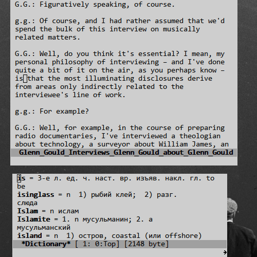

# Переводчик EN-RU, RU-EN для GNU Emacs.
(С Английского на Русский, с Русского на Английский.)

## Состав:

В каталоге [dictionary](dictionary) находятся словари Королева.
Словари взяты из проекта [opendict](https://github.com/nerijus/opendict).
Произведены изменения словарей:
1. Оба словаря переведены в формат `UTF-8`.
2. В русско-английском словаре буква "ё" заменена на "е". При поиске слова с буквой "ё", она так же заменяется на "е" перед поиском.
3. Из русско-английского словаря устранено дублирование слов.
4. Из русско-английского словаря удалены несколько незначительных строк со словами.

[dict-pars.el](dict-pars.el) - скрипт поиска по словарям:
  - функция `dict-manual` ищет слово на котором стоит курсор или по выделенной области(региону).
  - функция `dict-auto` ищет слово каждый раз когда курсор переходит на новое слово.

[search-table](search-table) - таблица поиска слов.

## Принцип работы:
- При первом обращении к скрипту, словари загрузятся в массив и будут висеть в памяти до окончании работы Emacs. Так же появится буфер Dictionary с переведенными словами.
- Функция `dict-auto` может подтормаживать на коротких словах. Я не стал это исправлять, так как такой режим работы мне не понравился. Что бы выключить режим работы `dict-auto` нужно просто еще раз вызвать `dict-auto`.
- Если скрипт не находит слово то поиск повторяется по первым буквам слова. см. функцию `dict-subword-table`.

## Картинка:



## Установка:

1. Скачать репозиторий:
```
% git clone https://github.com/bishop290/dict-eng-rus.git
```
2. Добавить в свой "init"/".emacs" файл:
```
(load "my-path/dict-eng-rus/dict-pars.el")

;; если не нужно автоматически открывать буфер с переводом.
(defconst DICT-SHOW-BUFFER? nil)
```
3. Назначить функцию перевода на кнопку, по желанию:
```
;; Например моя любимая кнопка "F2":
(global-set-key (kbd "<f2>") 'dict-manual)

```
